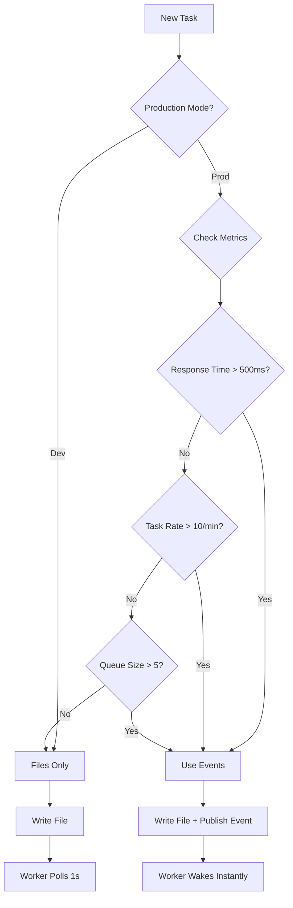

# Agent Activation System - Production Integration Guide

**Comprehensive answers to critical systems engineering questions for event-driven agent coordination.**

---

## 🐳 Question 1: Docker Integration Strategy

**How to integrate inotify/Redis into existing Docker containers?**

### Option A: Sidecar Wrapper (RECOMMENDED)

**Architecture:**
```
┌─────────────────────────────────────┐
│ Marie Container                     │
│  ┌──────────────────────────────┐  │
│  │ activation_wrapper.py        │  │
│  │ ├─ inotify/Redis listener    │  │
│  │ ├─ Signal handler            │  │
│  │ └─ Subprocess: claude CLI    │  │
│  └──────────────────────────────┘  │
└─────────────────────────────────────┘
```

**Implementation:**

```dockerfile
# core/docker-compose.yml
services:
  marie:
    image: docker/sandbox-templates:claude-code
    command: >
      bash -c "
      pip install --quiet watchdog redis &&
      python3 /tools/activation_wrapper.py marie
      "
    volumes:
      - ./tools/activation_wrapper.py:/tools/activation_wrapper.py:ro
      - ./shared/tasks/marie:/tasks:ro
      - ./shared/results/marie:/results:rw
    environment:
      - ACTIVATION_MODE=inotify  # or redis
      - REDIS_URL=redis://redis:6379
      - WORKER_NAME=marie
```

**Wrapper Script:**

```python
# tools/activation_wrapper.py
import os
import sys
import subprocess
import signal
import json
from pathlib import Path
from watchdog.observers import Observer
from watchdog.events import FileSystemEventHandler
import redis

class AgentActivator:
    def __init__(self, worker_name):
        self.worker_name = worker_name
        self.mode = os.getenv("ACTIVATION_MODE", "inotify")
        self.task_dir = Path(f"/tasks")
        self.result_dir = Path(f"/results")
        self.claude_process = None
        self.shutdown = False

        # Register signal handlers for graceful shutdown
        signal.signal(signal.SIGTERM, self.handle_shutdown)
        signal.signal(signal.SIGINT, self.handle_shutdown)

    def handle_shutdown(self, signum, frame):
        """Graceful shutdown on SIGTERM/SIGINT"""
        print(f"🛑 {self.worker_name}: Shutdown signal received")
        self.shutdown = True
        if self.claude_process and self.claude_process.poll() is None:
            print(f"⏳ Waiting for current task to complete...")
            self.claude_process.wait(timeout=60)
        sys.exit(0)

    def process_task(self, task_path):
        """Execute a single task with Claude"""
        task_data = json.loads(Path(task_path).read_text())
        task_id = task_data['task_id']

        print(f"🔔 {self.worker_name}: Activated for task {task_id}")

        # Execute with Claude CLI in subprocess
        self.claude_process = subprocess.Popen(
            ["claude", "-p", task_data['description']],
            stdout=subprocess.PIPE,
            stderr=subprocess.PIPE,
            text=True
        )

        try:
            stdout, stderr = self.claude_process.communicate(timeout=600)

            # Write result
            result = {
                "task_id": task_id,
                "worker": self.worker_name,
                "stdout": stdout,
                "stderr": stderr,
                "exit_code": self.claude_process.returncode
            }

            result_path = self.result_dir / f"{task_id}.json"
            result_path.write_text(json.dumps(result, indent=2))

            # Clean up task file
            Path(task_path).unlink()

            print(f"✅ {self.worker_name}: Completed {task_id}")

        except subprocess.TimeoutExpired:
            print(f"⚠️ {self.worker_name}: Task {task_id} timed out")
            self.claude_process.kill()
        finally:
            self.claude_process = None

    def run_inotify(self):
        """inotify-based activation"""
        class TaskWatcher(FileSystemEventHandler):
            def __init__(self, activator):
                self.activator = activator

            def on_created(self, event):
                if not event.is_directory and event.src_path.endswith('.json'):
                    self.activator.process_task(event.src_path)

        observer = Observer()
        observer.schedule(TaskWatcher(self), str(self.task_dir))
        observer.start()

        print(f"🎧 {self.worker_name}: inotify listener active (0% CPU)")

        try:
            while not self.shutdown:
                observer.join(1)
        except KeyboardInterrupt:
            pass
        finally:
            observer.stop()
            observer.join()

    def run_redis(self):
        """Redis pub/sub activation"""
        redis_url = os.getenv("REDIS_URL", "redis://localhost:6379")
        r = redis.from_url(redis_url)
        pubsub = r.pubsub()
        channel = f"activate:{self.worker_name}"
        pubsub.subscribe(channel)

        print(f"🎧 {self.worker_name}: Redis listener on '{channel}' (0% CPU)")

        for message in pubsub.listen():
            if self.shutdown:
                break

            if message['type'] == 'message':
                task_path = message['data'].decode()
                if Path(task_path).exists():
                    self.process_task(task_path)
                else:
                    print(f"⚠️ Task file missing: {task_path}")

    def start(self):
        """Start activation system"""
        if self.mode == "redis":
            self.run_redis()
        else:
            self.run_inotify()

if __name__ == "__main__":
    worker_name = sys.argv[1] if len(sys.argv) > 1 else "worker"
    activator = AgentActivator(worker_name)
    activator.start()
```

**Benefits:**
- ✅ Zero modification to Claude CLI
- ✅ Works with existing container structure
- ✅ Easy to test/debug independently
- ✅ Can hot-swap activation mode via env var

### Option B: Init Script Modification

Modify container startup in `docker-compose.yml`:

```yaml
marie:
  command: >
    bash -c "
    pip install watchdog redis &&
    /tools/setup_activation.sh marie &&
    exec claude
    "
```

---

## ⚡ Question 2: Signal Queueing During Task Processing

**What happens if signal arrives while worker is busy?**

### Problem: Race Condition

```
Time  Orchestrator         Marie
----- -------------------- --------------------
t0    Create task-001.json → Marie processing
t1    Create task-002.json → Marie still busy
t2                           ❌ task-002 signal lost?
```

### Solution: Task Queue with State Machine

```python
# Enhanced activation_wrapper.py
from queue import Queue
from threading import Thread, Lock
import enum

class TaskState(enum.Enum):
    PENDING = "pending"
    PROCESSING = "processing"
    COMPLETED = "completed"
    FAILED = "failed"

class QueuedAgentActivator(AgentActivator):
    def __init__(self, worker_name):
        super().__init__(worker_name)
        self.task_queue = Queue()
        self.current_task = None
        self.state_lock = Lock()
        self.task_states = {}  # task_id -> TaskState

    def queue_task(self, task_path):
        """Add task to queue (thread-safe)"""
        task_data = json.loads(Path(task_path).read_text())
        task_id = task_data['task_id']

        with self.state_lock:
            if task_id not in self.task_states:
                self.task_states[task_id] = TaskState.PENDING
                self.task_queue.put(task_path)
                print(f"📥 {self.worker_name}: Queued {task_id} (queue size: {self.task_queue.qsize()})")
            else:
                print(f"⚠️ {self.worker_name}: Duplicate task {task_id} ignored")

    def process_queue(self):
        """Worker thread that processes queue sequentially"""
        while not self.shutdown:
            try:
                task_path = self.task_queue.get(timeout=1)

                with self.state_lock:
                    task_data = json.loads(Path(task_path).read_text())
                    task_id = task_data['task_id']
                    self.task_states[task_id] = TaskState.PROCESSING
                    self.current_task = task_id

                # Process task (blocks here)
                try:
                    self.process_task(task_path)
                    with self.state_lock:
                        self.task_states[task_id] = TaskState.COMPLETED
                except Exception as e:
                    print(f"❌ {self.worker_name}: Task {task_id} failed: {e}")
                    with self.state_lock:
                        self.task_states[task_id] = TaskState.FAILED
                finally:
                    with self.state_lock:
                        self.current_task = None

                self.task_queue.task_done()

            except Exception:
                continue  # Timeout, retry

    def run_inotify(self):
        """inotify with queueing"""
        # Start worker thread
        worker_thread = Thread(target=self.process_queue, daemon=True)
        worker_thread.start()

        class TaskWatcher(FileSystemEventHandler):
            def __init__(self, activator):
                self.activator = activator

            def on_created(self, event):
                if not event.is_directory and event.src_path.endswith('.json'):
                    self.activator.queue_task(event.src_path)

        observer = Observer()
        observer.schedule(TaskWatcher(self), str(self.task_dir))
        observer.start()

        print(f"🎧 {self.worker_name}: inotify + queue active")

        try:
            while not self.shutdown:
                observer.join(1)
        finally:
            observer.stop()
            worker_thread.join(timeout=5)
```

**Behavior:**
- ✅ All signals captured, never lost
- ✅ Tasks processed sequentially (FIFO)
- ✅ Duplicate task detection
- ✅ Observable queue size for monitoring

**State Tracking:**

```python
# Check current state
def get_status(self):
    with self.state_lock:
        return {
            "worker": self.worker_name,
            "current_task": self.current_task,
            "queue_size": self.task_queue.qsize(),
            "task_states": dict(self.task_states)
        }
```

**Redis Pub/Sub Alternative:**

Redis naturally queues messages in subscription buffer:

```python
# Messages automatically queue in Redis client buffer
for message in pubsub.listen():  # Blocks until next message
    process(message)  # Sequential processing
```

---

## 🛡️ Question 3: Graceful Shutdown & Orphan Task Handling

**What happens when orchestrator crashes?**

### Problem Scenarios

| Scenario | Risk | Impact |
|----------|------|--------|
| Orchestrator crashes mid-task creation | Half-written task file | Worker reads corrupt JSON |
| Orchestrator crashes after task sent | Task processed, no listener for result | Result orphaned |
| Worker crashes during task | Task file exists, no result | Orchestrator never gets response |
| Redis down | Workers can't receive signals | System appears frozen |

### Solution: Atomic Writes + Heartbeat + Dead Letter Queue

#### 1. Atomic Task File Creation

```python
# Orchestrator writes atomically
import tempfile
import shutil

def create_task_atomic(task_data, worker_name):
    """Write task file atomically (never corrupt)"""
    task_id = task_data['task_id']

    # Write to temp file first
    temp_path = Path(f"/tasks/{worker_name}/.tmp_{task_id}.json")
    temp_path.write_text(json.dumps(task_data))

    # Atomic rename (OS-level operation, can't be interrupted)
    final_path = Path(f"/tasks/{worker_name}/{task_id}.json")
    shutil.move(str(temp_path), str(final_path))

    print(f"✅ Task {task_id} written atomically")
```

Worker ignores `.tmp_*` files in inotify:

```python
def on_created(self, event):
    if not event.src_path.endswith('.json'):
        return
    if '/.tmp_' in event.src_path:
        return  # Ignore temp files
    self.activator.queue_task(event.src_path)
```

#### 2. Heartbeat Mechanism

Workers send periodic heartbeats:

```python
# Worker heartbeat
import time
from datetime import datetime

class HeartbeatWorker(Thread):
    def __init__(self, worker_name, interval=10):
        super().__init__(daemon=True)
        self.worker_name = worker_name
        self.interval = interval
        self.heartbeat_file = Path(f"/shared/heartbeats/{worker_name}.json")
        self.shutdown = False

    def run(self):
        while not self.shutdown:
            heartbeat = {
                "worker": self.worker_name,
                "timestamp": datetime.utcnow().isoformat(),
                "current_task": activator.current_task,
                "queue_size": activator.task_queue.qsize(),
                "status": "alive"
            }
            self.heartbeat_file.write_text(json.dumps(heartbeat))
            time.sleep(self.interval)

# Start heartbeat
heartbeat = HeartbeatWorker(worker_name)
heartbeat.start()
```

Orchestrator monitors heartbeats:

```python
# Orchestrator health check
def check_worker_health(worker_name, timeout=30):
    """Check if worker is alive"""
    heartbeat_file = Path(f"/shared/heartbeats/{worker_name}.json")

    if not heartbeat_file.exists():
        return False, "No heartbeat file"

    heartbeat = json.loads(heartbeat_file.read_text())
    last_seen = datetime.fromisoformat(heartbeat['timestamp'])
    age = (datetime.utcnow() - last_seen).total_seconds()

    if age > timeout:
        return False, f"Last seen {age:.0f}s ago (timeout: {timeout}s)"

    return True, heartbeat

# Check all workers
for worker in ['marie', 'anga', 'fabien']:
    alive, status = check_worker_health(worker)
    print(f"{worker}: {'✅' if alive else '❌'} {status}")
```

#### 3. Orphan Task Recovery

```python
# Orchestrator scans for orphaned tasks on startup
def recover_orphaned_tasks():
    """Find tasks that were never completed"""
    for worker in ['marie', 'anga', 'fabien']:
        task_dir = Path(f"/tasks/{worker}")
        result_dir = Path(f"/results/{worker}")

        # Find tasks without results
        for task_file in task_dir.glob("*.json"):
            task_id = task_file.stem
            result_file = result_dir / f"{task_id}.json"

            if not result_file.exists():
                age = time.time() - task_file.stat().st_mtime

                if age > 600:  # 10 minutes old
                    print(f"⚠️ Orphan task detected: {task_id} ({age:.0f}s old)")

                    # Options:
                    # 1. Re-queue to dead letter queue
                    dlq_path = Path(f"/tasks/.dead_letter/{task_id}.json")
                    shutil.move(task_file, dlq_path)

                    # 2. Or re-send to worker
                    # signal_worker(worker, task_file)

                    # 3. Or alert human
                    # alert(f"Task {task_id} orphaned on {worker}")

# Run on orchestrator startup
recover_orphaned_tasks()
```

#### 4. Redis Failure Fallback

```python
# Worker detects Redis failure and falls back to inotify
def start_with_fallback(self):
    try:
        if self.mode == "redis":
            self.run_redis()
    except redis.ConnectionError:
        print(f"⚠️ Redis unavailable, falling back to inotify")
        self.mode = "inotify"
        self.run_inotify()
```

#### 5. Graceful Shutdown Protocol

```yaml
# docker-compose.yml
services:
  marie:
    stop_grace_period: 60s  # Give 60s to finish current task
    stop_signal: SIGTERM     # Graceful shutdown signal
```

Worker handles shutdown:

```python
def handle_shutdown(self, signum, frame):
    """Graceful shutdown"""
    print(f"🛑 {self.worker_name}: Shutdown initiated")
    self.shutdown = True

    if self.current_task:
        print(f"⏳ Waiting for task {self.current_task} to complete...")
        # Wait for claude_process to finish
        if self.claude_process:
            self.claude_process.wait(timeout=50)  # 10s buffer before docker kills
        print(f"✅ Task {self.current_task} completed before shutdown")

    # Gracefully close connections
    if hasattr(self, 'observer'):
        self.observer.stop()

    sys.exit(0)
```

---

## 🔀 Question 4: Hybrid Approach Decision Matrix

**When to use files vs events? What triggers the switch?**

### Decision Flowchart



### Automatic Mode Selection

```python
# Orchestrator intelligently chooses communication method
class AdaptiveOrchestrator:
    def __init__(self):
        self.mode = os.getenv("ORCHESTRATOR_MODE", "auto")  # auto|files|events
        self.redis = redis.from_url(os.getenv("REDIS_URL"))
        self.metrics = {
            'avg_response_time_ms': 0,
            'task_rate_per_min': 0,
            'queue_sizes': {}
        }

    def should_use_events(self, worker_name):
        """Decide whether to use events based on current metrics"""

        if self.mode == "files":
            return False
        elif self.mode == "events":
            return True
        elif self.mode == "auto":
            # Automatic decision based on metrics

            # Rule 1: Response time threshold
            if self.metrics['avg_response_time_ms'] > 500:
                return True

            # Rule 2: High task rate
            if self.metrics['task_rate_per_min'] > 10:
                return True

            # Rule 3: Queue backup
            queue_size = self.metrics['queue_sizes'].get(worker_name, 0)
            if queue_size > 5:
                return True

            # Rule 4: Development mode (files easier to debug)
            if os.getenv("NODE_ENV") == "development":
                return False

            # Default: files (simpler)
            return False

    def dispatch_task(self, worker_name, task_data):
        """Dispatch task with automatic mode selection"""
        task_id = task_data['task_id']

        # Always write file (persistence)
        task_path = self.write_task_file(worker_name, task_data)

        # Conditionally send event (speed)
        if self.should_use_events(worker_name):
            try:
                self.redis.publish(f"activate:{worker_name}", task_path)
                print(f"📡 {worker_name}: Task {task_id} dispatched via EVENT")
            except redis.ConnectionError:
                print(f"⚠️ Redis unavailable, relying on file polling")
        else:
            print(f"📄 {worker_name}: Task {task_id} dispatched via FILE")

        return task_id

    def update_metrics(self):
        """Continuously monitor system metrics"""
        # Calculate average response time
        results = list(Path("/results").rglob("*.json"))
        if results:
            times = [self.get_response_time(r) for r in results[-100:]]
            self.metrics['avg_response_time_ms'] = sum(times) / len(times)

        # Calculate task rate
        recent_tasks = [t for t in results if time.time() - t.stat().st_mtime < 60]
        self.metrics['task_rate_per_min'] = len(recent_tasks)

        # Check queue sizes
        for worker in ['marie', 'anga', 'fabien']:
            heartbeat_file = Path(f"/shared/heartbeats/{worker}.json")
            if heartbeat_file.exists():
                hb = json.loads(heartbeat_file.read_text())
                self.metrics['queue_sizes'][worker] = hb.get('queue_size', 0)
```

### Configuration Matrix

| Scenario | Mode | Reason |
|----------|------|--------|
| Local development | `files` | Easy debugging, can inspect `.json` files |
| CI/CD testing | `files` | Reproducible, no external dependencies |
| Staging | `auto` | Test automatic switching |
| Production (low load) | `files` | Simple, reliable |
| Production (high load) | `events` | Low latency, scalable |
| Production (critical) | `events` + `files` | Redundancy (event for speed, file for reliability) |

### Environment-Based Config

```yaml
# .env.development
ORCHESTRATOR_MODE=files
REDIS_URL=redis://localhost:6379

# .env.staging
ORCHESTRATOR_MODE=auto
RESPONSE_TIME_THRESHOLD_MS=500
TASK_RATE_THRESHOLD=10

# .env.production
ORCHESTRATOR_MODE=events
REDIS_URL=redis://redis-cluster:6379
FALLBACK_TO_FILES=true
```

### Manual Override

```bash
# Force event mode
docker exec orchestrator \
  curl -X POST http://localhost:8000/config \
  -d '{"mode": "events"}'

# Check current mode
docker exec orchestrator \
  curl http://localhost:8000/config
# Response: {"mode": "auto", "current_decision": "events", "metrics": {...}}
```

---

## 🎯 Recommended Implementation Roadmap

### Phase 1: Quick Win (1-2 hours)
1. ✅ Add `activation_wrapper.py` with inotify
2. ✅ Modify `docker-compose.yml` to use wrapper
3. ✅ Test locally: `make restart-workers`
4. ✅ Verify zero CPU when idle

### Phase 2: Production Hardening (1 day)
1. ✅ Add task queueing (handle concurrent signals)
2. ✅ Implement heartbeat monitoring
3. ✅ Add atomic file writes
4. ✅ Implement orphan task recovery

### Phase 3: Observability (1 day)
1. ✅ Add Prometheus metrics
2. ✅ Create Grafana dashboard
3. ✅ Set up alerting (worker down, queue backup)

### Phase 4: Hybrid Intelligence (2 days)
1. ✅ Implement adaptive mode selection
2. ✅ Add Redis pub/sub fallback
3. ✅ Performance testing and tuning

---

## 📊 Monitoring Dashboard

```python
# Expose metrics endpoint
from prometheus_client import start_http_server, Gauge, Counter

task_queue_size = Gauge('task_queue_size', 'Tasks in queue', ['worker'])
task_processing_time = Gauge('task_processing_seconds', 'Task duration', ['worker'])
tasks_completed = Counter('tasks_completed_total', 'Completed tasks', ['worker'])
activation_latency = Gauge('activation_latency_ms', 'Time to wake up', ['worker'])

# Update metrics
task_queue_size.labels(worker=worker_name).set(queue.qsize())
```

**Grafana queries:**
- Average queue size per worker
- P95 activation latency
- Tasks completed per minute
- Worker health status

---

## ✅ Testing Strategy

```python
# tests/test_activation.py
def test_inotify_wakeup():
    """Test worker wakes up instantly on file creation"""
    start = time.time()

    # Create task file
    Path("/tasks/marie/test-001.json").write_text('{"task_id": "test-001"}')

    # Wait for result
    while not Path("/results/marie/test-001.json").exists():
        time.sleep(0.01)
        assert time.time() - start < 0.1, "Wakeup took > 100ms"

    latency = (time.time() - start) * 1000
    assert latency < 50, f"Latency {latency}ms exceeds 50ms threshold"

def test_graceful_shutdown():
    """Test worker completes current task before shutdown"""
    # Start long-running task
    create_task("marie", "sleep 30")

    # Send SIGTERM
    subprocess.run(["docker", "kill", "-s", "SIGTERM", "marie"])

    # Verify task completed
    time.sleep(35)
    assert result_exists("test-shutdown"), "Task not completed before shutdown"

def test_orphan_recovery():
    """Test orchestrator recovers orphaned tasks"""
    # Create orphaned task (>10min old)
    task_path = Path("/tasks/marie/orphan-001.json")
    task_path.write_text('{"task_id": "orphan-001"}')
    os.utime(task_path, (0, 0))  # Set to 1970

    # Restart orchestrator
    subprocess.run(["docker", "restart", "orchestrator"])

    # Verify task moved to DLQ
    assert Path("/tasks/.dead_letter/orphan-001.json").exists()
```

---

## 🚀 Summary

| Question | Solution | Implementation Time |
|----------|----------|---------------------|
| Docker integration | Sidecar wrapper | 1-2 hours |
| Signal queueing | Thread-safe Queue + state machine | 3-4 hours |
| Graceful shutdown | Atomic writes + heartbeats + DLQ | 1 day |
| Hybrid decision | Adaptive mode selection + metrics | 2 days |

**Total MVP:** 2-3 days for production-ready event-driven system.

**Next steps:**
1. Review `activation_wrapper.py` implementation
2. Test locally with `make restart-workers`
3. Monitor metrics in Grafana
4. Gradually enable `auto` mode in staging
