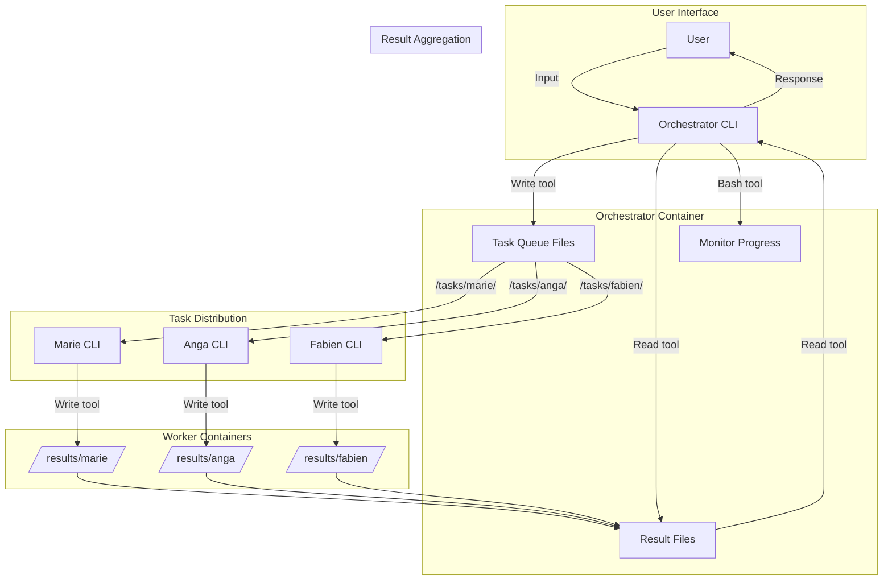

# Multi-Agent Claude Code CLI Architecture

## Executive Summary

This architecture implements a multi-agent orchestration system using **native Claude Code CLI instances** communicating via file-based task queues. Each agent (orchestrator and workers) is a full Claude Code CLI process using web session authentication and built-in tools (Read, Write, Bash, Grep).

**Key Principle**: NO Python scripts, NO API calls - pure Claude Code CLI orchestration.

## System Architecture



## Core Components

### 1. Orchestrator (Claude Code CLI Instance)

**Process**: `claude --system-prompt-file orchestrator.md`

**Authentication**: Web session stored in `/home/agent/.claude/`

**Responsibilities**:
- Receive user input via interactive CLI
- Decompose tasks using Claude's reasoning
- Write task files using Write tool
- Monitor completion using Bash tool
- Read results using Read tool
- Synthesize and respond to user

**Tools Used**:
- `Write` - Create task files in `/tasks/{worker}/`
- `Read` - Read result files from `/results/{worker}/`
- `Bash` - Monitor file system, watch for completion
- `Grep` - Search through results

### 2. Worker Agents (Claude Code CLI Instances)

**Process**: `claude --system-prompt-file {WORKER}.md`

**Workers**:
- **Marie** (Dance Teacher): `claude --system-prompt-file DANCE.md`
- **Anga** (Coder): `claude --system-prompt-file ANGA.md`
- **Fabien** (Marketing): `claude --system-prompt-file FABIEN.md`

**Each Worker**:
- Monitors their task directory using Bash tool
- Reads task files using Read tool
- Executes tasks using their specialized tools
- Writes results using Write tool
- Deletes completed tasks using Bash tool

## File-Based Communication Protocol

### Task File Format

**Location**: `/tasks/{worker}/task-{id}.json`

```json
{
  "task_id": "task-001",
  "timestamp": "2024-11-17T10:30:00Z",
  "priority": "high",
  "description": "Evaluate dance student Emma's progress",
  "context": {
    "student_name": "Emma",
    "class_level": "intermediate",
    "evaluation_type": "quarterly"
  },
  "requirements": [
    "Review technique progress",
    "Assess performance readiness",
    "Generate progress report"
  ],
  "timeout_seconds": 600,
  "output_format": "markdown"
}
```

### Result File Format

**Location**: `/results/{worker}/task-{id}.json`

```json
{
  "task_id": "task-001",
  "worker": "marie",
  "status": "complete",
  "timestamp_start": "2024-11-17T10:31:00Z",
  "timestamp_complete": "2024-11-17T10:35:00Z",
  "execution_time_seconds": 240,
  "findings": {
    "summary": "Emma shows excellent progress in technique",
    "details": [
      "Strong improvement in turns",
      "Musicality developing well",
      "Ready for advanced class"
    ]
  },
  "artifacts": [
    {
      "type": "report",
      "path": "/results/marie/reports/emma-q4-eval.md",
      "description": "Quarterly evaluation report"
    }
  ],
  "logs": [
    "Task received at 10:31:00",
    "Analysis completed at 10:34:30",
    "Report generated at 10:35:00"
  ],
  "errors": []
}
```

## Docker Architecture

### Container Structure

```yaml
services:
  orchestrator:
    image: docker/sandbox-templates:claude-code
    command: claude --system-prompt-file /prompts/orchestrator.md
    volumes:
      - ./auth-homes/orchestrator:/home/agent/.claude:rw
      - ./prompts:/prompts:ro
      - ./tasks:/tasks:rw
      - ./results:/results:rw
      - ./shared:/workspace:rw

  marie:
    image: docker/sandbox-templates:claude-code
    command: claude --system-prompt-file /prompts/DANCE.md
    volumes:
      - ./auth-homes/marie:/home/agent/.claude:rw
      - ./prompts:/prompts:ro
      - ./tasks/marie:/tasks:ro
      - ./results/marie:/results:rw
      - ./shared:/workspace:ro
```

### Volume Strategy

```
orchestration/cli/
├── auth-homes/           # Web session authentication
│   ├── orchestrator/     # Orchestrator's .claude directory
│   │   └── .claude/
│   │       ├── config.json
│   │       └── session.json
│   ├── marie/
│   ├── anga/
│   └── fabien/
├── prompts/              # System prompts
│   ├── orchestrator.md
│   ├── DANCE.md
│   ├── ANGA.md
│   └── FABIEN.md
├── tasks/                # Task queue directories
│   ├── marie/
│   ├── anga/
│   └── fabien/
├── results/              # Result directories
│   ├── marie/
│   ├── anga/
│   └── fabien/
└── shared/              # Shared workspace
```

## System Prompts

### Orchestrator Prompt Structure

```markdown
You are the orchestrator coordinating worker agents via file system.

## Core Loop
1. Await user input
2. Analyze and decompose into tasks
3. Use Write tool to create task files
4. Use Bash tool to monitor progress
5. Use Read tool to collect results
6. Synthesize and respond

## Tools Usage
- Write: Create task files in /tasks/{worker}/
- Read: Read results from /results/{worker}/
- Bash: Monitor with `ls`, `watch`, `find`
- Never use Python, only CLI tools
```

### Worker Prompt Structure

```markdown
You are {WORKER_NAME}, a specialized assistant.

## Core Loop
1. Use Bash to check for new tasks: ls /tasks/*.json
2. Use Read to get task details
3. Execute using your specialized knowledge
4. Use Write to save results
5. Use Bash to delete completed task file

## Tools Usage
- Bash: Monitor tasks, cleanup
- Read: Get task details
- Write: Save results and artifacts
- Your specialized tools as needed
```

## Execution Flow

### 1. Initialization Phase

```bash
# Each container starts its CLI instance
docker-compose up -d

# Orchestrator starts:
claude --system-prompt-file orchestrator.md

# Workers start:
claude --system-prompt-file DANCE.md
claude --system-prompt-file ANGA.md
claude --system-prompt-file FABIEN.md
```

### 2. Task Distribution

Orchestrator receives user request:
```
User: "Evaluate all dance students and create a marketing campaign"
```

Orchestrator uses Write tool:
```javascript
// Write task for Marie
Write({
  file_path: "/tasks/marie/task-001.json",
  content: JSON.stringify({
    task_id: "task-001",
    description: "Evaluate all dance students"
    // ...
  })
})

// Write task for Fabien
Write({
  file_path: "/tasks/fabien/task-002.json",
  content: JSON.stringify({
    task_id: "task-002",
    description: "Create marketing campaign"
    // ...
  })
})
```

### 3. Worker Processing

Marie's loop (in DANCE.md prompt):
```javascript
// Check for tasks
Bash("ls /tasks/*.json")

// Read task
Read("/tasks/task-001.json")

// Process task...

// Write results
Write({
  file_path: "/results/task-001.json",
  content: JSON.stringify(results)
})

// Clean up
Bash("rm /tasks/task-001.json")
```

### 4. Result Collection

Orchestrator monitors and collects:
```javascript
// Monitor completion
Bash("watch -n 1 'ls /results/*/*.json'")

// Read results
Read("/results/marie/task-001.json")
Read("/results/fabien/task-002.json")

// Synthesize and respond to user
```

## Authentication Strategy

### Web Session Authentication

Each CLI instance uses **web-based authentication** (NOT API keys):

1. **Initial Setup** (one-time per agent):
```bash
# Start container with interactive shell
docker exec -it claude-orchestrator bash

# Run Claude and authenticate
claude login

# Browser opens for authentication
# Session saved to /home/agent/.claude/
```

2. **Session Persistence**:
- Sessions stored in `auth-homes/{agent}/.claude/`
- Mounted as volumes for persistence
- Each agent has isolated authentication

3. **No API Keys Required**:
- Remove all `ANTHROPIC_API_KEY` environment variables
- Remove all Python API client code
- Authentication handled by CLI's web session

## Advantages Over API-Based Approach

1. **Native Tool Integration**: Uses Claude's built-in tools (Read, Write, Bash, Grep)
2. **Web Authentication**: No API key management or rotation
3. **Cost Efficiency**: Benefits from Claude Code's pricing model
4. **Tool Consistency**: Same tools in orchestrator and workers
5. **No Python Dependencies**: Pure CLI, no custom scripts
6. **Simpler Debugging**: Can interact with any agent directly
7. **Natural Language Processing**: CLI handles all NLP internally

## Implementation Checklist

- [ ] Remove all Python files (orchestrator.py, worker_loop.py, etc.)
- [ ] Create proper system prompts with tool usage instructions
- [ ] Update docker-compose.yml to use `claude` command directly
- [ ] Set up web authentication for each agent
- [ ] Create directory structure for tasks/results
- [ ] Test file-based communication flow
- [ ] Document monitoring and debugging procedures

## Monitoring & Debugging

### Health Checks

```bash
# Check if CLI instances are running
docker exec orchestrator ps aux | grep claude

# Watch task queue
docker exec orchestrator bash -c "watch -n 1 'ls -la /tasks/*/*.json'"

# Monitor results
docker exec orchestrator bash -c "watch -n 1 'ls -la /results/*/*.json'"
```

### Direct Interaction

```bash
# Interact with orchestrator
docker exec -it orchestrator bash
# Then use Claude's tools directly

# Debug a specific worker
docker exec -it marie bash
# Check tasks, results, logs
```

### Logging

Each CLI instance logs to:
- Container stdout/stderr (docker logs)
- Optional file logging via Bash redirects
- Result files contain execution logs

## Scaling Considerations

### Horizontal Scaling

- Add more workers of same type (marie-1, marie-2)
- Round-robin task distribution
- Shared result collection

### Resource Allocation

```yaml
orchestrator:
  resources:
    limits:
      cpus: '4.0'
      memory: 8G

worker:
  resources:
    limits:
      cpus: '2.0'
      memory: 4G
```

### Performance Optimization

1. **Task Batching**: Group related tasks
2. **Result Caching**: Store frequently used data in shared volume
3. **Parallel Processing**: Multiple workers of same type
4. **Priority Queues**: High-priority task directories

## Security Model

1. **Container Isolation**: Each agent runs in isolated container
2. **Volume Permissions**: Read-only where appropriate
3. **Authentication Isolation**: Separate .claude directories
4. **No Network Dependencies**: File-based communication only
5. **Capability Restrictions**: Minimal Linux capabilities

## Conclusion

This architecture leverages Claude Code CLI's native capabilities for multi-agent orchestration without any Python code or API dependencies. The system is simpler, more maintainable, and uses Claude's built-in tools for all operations.