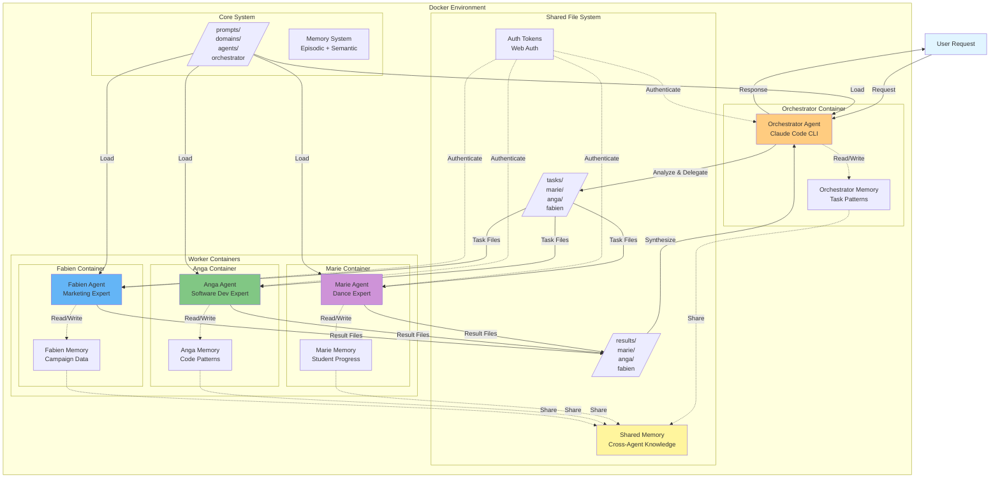
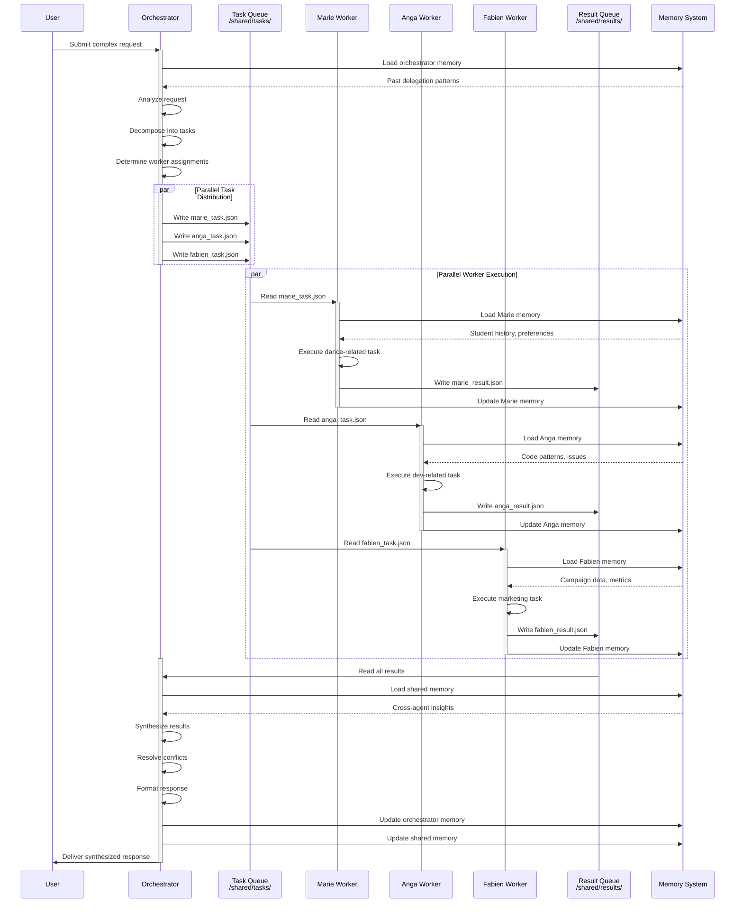
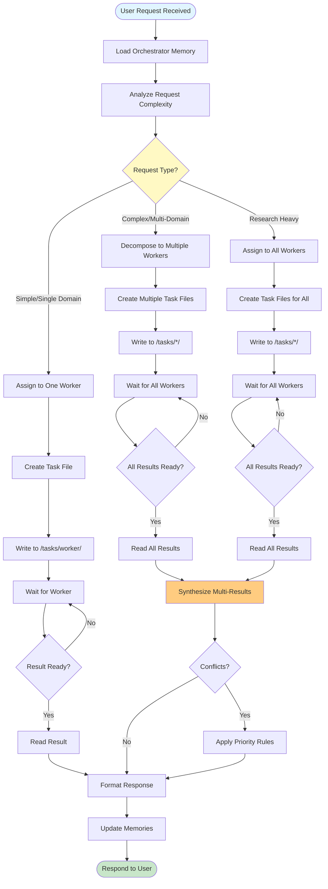
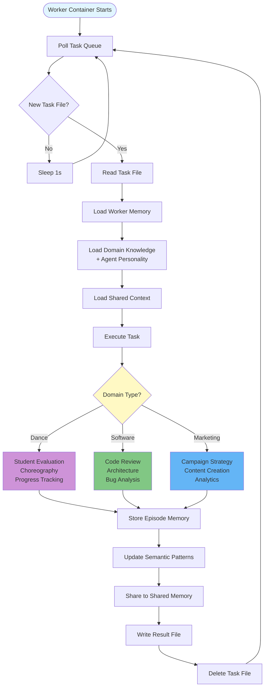
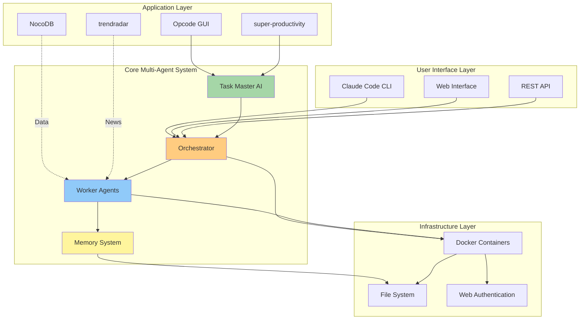

# codehornets-ai Architecture Diagrams

## 1. High-Level System Architecture

## 2. Data Flow Sequence

## 3. Memory System Architecture

```mermaid
graph TB
    subgraph "Memory Layer"
        subgraph "Episodic Memory"
            EpiMarie[Marie Episodes<br/>Student interactions]
            EpiAnga[Anga Episodes<br/>Code reviews]
            EpiFabien[Fabien Episodes<br/>Campaigns]
            EpiOrch[Orchestrator Episodes<br/>Delegations]
        end

        subgraph "Semantic Memory"
            SemMarie[Marie Patterns<br/>Teaching methods]
            SemAnga[Anga Patterns<br/>Code issues]
            SemFabien[Fabien Patterns<br/>Marketing trends]
            SemOrch[Orchestrator Patterns<br/>Task types]
        end

        subgraph "Shared Memory"
            SharedPrefs[User Preferences]
            SharedContext[Cross-Agent Context]
            SharedLearning[Collaborative Learning]
        end

        subgraph "Task Master Memory"
            TMPatterns[Execution Patterns]
            TMSuccess[Success Metrics]
        end
    end

    subgraph "Storage Backend"
        JSON[JSON Files<br/>Structured Data]
        Pickle[Pickle Files<br/>Python Objects]
        Vector[Vector Store<br/>Similarity Search]
    end

    EpiMarie --> JSON
    EpiAnga --> JSON
    EpiFabien --> JSON
    EpiOrch --> JSON

    SemMarie --> Vector
    SemAnga --> Vector
    SemFabien --> Vector
    SemOrch --> Vector

    SharedPrefs --> Pickle
    SharedContext --> Pickle
    SharedLearning --> Vector

    TMPatterns --> JSON
    TMSuccess --> JSON

    style EpiMarie fill:#ce93d8
    style EpiAnga fill:#81c784
    style EpiFabien fill:#64b5f6
    style EpiOrch fill:#ffcc80
    style SharedPrefs fill:#fff59d
```

## 4. Task Delegation Flow

## 5. Worker Execution Flow

## 6. File-Based Communication Protocol

```mermaid
graph LR
    subgraph "Orchestrator Process"
        O1[Analyze Request]
        O2[Create Task JSON]
        O3[Write to Queue]
        O4[Poll for Results]
        O5[Read Results]
        O6[Synthesize]
    end

    subgraph "File System"
        subgraph "Task Queue"
            TM[marie_task.json]
            TA[anga_task.json]
            TF[fabien_task.json]
        end

        subgraph "Result Queue"
            RM[marie_result.json]
            RA[anga_result.json]
            RF[fabien_result.json]
        end
    end

    subgraph "Worker Processes"
        subgraph "Marie Process"
            M1[Poll Tasks]
            M2[Execute]
            M3[Write Result]
        end

        subgraph "Anga Process"
            A1[Poll Tasks]
            A2[Execute]
            A3[Write Result]
        end

        subgraph "Fabien Process"
            F1[Poll Tasks]
            F2[Execute]
            F3[Write Result]
        end
    end

    O1 --> O2 --> O3

    O3 --> TM
    O3 --> TA
    O3 --> TF

    TM --> M1
    TA --> A1
    TF --> F1

    M1 --> M2 --> M3
    A1 --> A2 --> A3
    F1 --> F2 --> F3

    M3 --> RM
    A3 --> RA
    F3 --> RF

    RM --> O4
    RA --> O4
    RF --> O4

    O4 --> O5 --> O6

    style TM fill:#ce93d8
    style TA fill:#81c784
    style TF fill:#64b5f6
    style RM fill:#ce93d8
    style RA fill:#81c784
    style RF fill:#64b5f6
```

## 7. Complete System Integration

## Key Metrics

- **Performance Improvement**: 90.2% faster than single-agent
- **Memory Reduction**: 30-50% fewer clarification rounds
- **Scalability**: Linear with number of workers
- **Isolation**: Full container isolation per agent
- **Communication**: File-based (inspectable, debuggable)
- **Persistence**: Cross-session memory retention

## Architecture Principles

1. **Separation of Concerns**: Each worker has single domain expertise
2. **Parallel Execution**: Tasks run concurrently for speed
3. **File-Based IPC**: Simple, debuggable communication
4. **Container Isolation**: No cross-contamination of contexts
5. **Memory Persistence**: Continuous learning across sessions
6. **Single Source of Truth**: All prompts in `/core/prompts/`
7. **Web Authentication**: Cost-effective (no API token costs)
