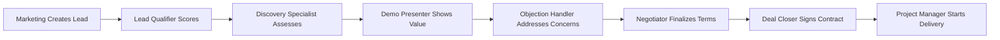
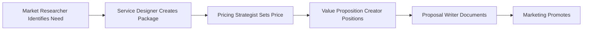
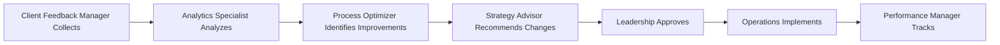
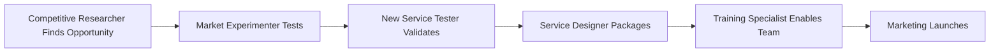

# Digital Agency AI Platform - Organization Mind Map

## 🎯 Executive Overview

This document provides a comprehensive mind map of the Digital Agency AI Platform organization, showing the complete structure of domains, roles (AI agents), tasks, tools, and workflows.

---

## 📊 High-Level Mind Map (Mermaid Diagram)

```mermaid
graph TB
    root[Digital Agency AI Platform]

    root --> offer[01_OFFER]
    root --> marketing[02_MARKETING]
    root --> sales[03_SALES]
    root --> fulfillment[04_FULFILLMENT]
    root --> feedback[05_FEEDBACK_LOOP]
    root --> bizdev[06_BUSINESS_DEV]
    root --> ops[06_OPERATIONS]
    root --> support[07_CUSTOMER_SUPPORT]
    root --> leadership[08_LEADERSHIP]
    root --> innovation[09_INNOVATION]
    root --> enablement[10_ENABLEMENT]

    %% Offer Domain
    offer --> offer1[Market Researcher]
    offer --> offer2[Service Designer]
    offer --> offer3[Pricing Strategist]
    offer --> offer4[Value Proposition Creator]
    offer --> offer5[Proposal Writer]
    offer --> offer6[Competitor Analyst]

    %% Marketing Domain
    marketing --> mkt1[Content Creator]
    marketing --> mkt2[Social Media Manager]
    marketing --> mkt3[SEO Specialist]
    marketing --> mkt4[Email Marketer]
    marketing --> mkt5[Ads Manager]
    marketing --> mkt6[Brand Designer]

    %% Sales Domain
    sales --> s1[Lead Qualifier]
    sales --> s2[Discovery Specialist]
    sales --> s3[Demo Presenter]
    sales --> s4[Objection Handler]
    sales --> s5[Negotiator]
    sales --> s6[Deal Closer]

    %% Fulfillment Domain
    fulfillment --> f1[Project Manager]
    fulfillment --> f2[Creative Producer]
    fulfillment --> f3[Quality Checker]
    fulfillment --> f4[Delivery Coordinator]
    fulfillment --> f5[Account Manager]
    fulfillment --> f6[Client Reporter]

    %% Feedback Loop
    feedback --> fb1[Analytics Specialist]
    feedback --> fb2[Client Feedback Manager]
    feedback --> fb3[Market Intelligence Analyst]
    feedback --> fb4[Process Optimizer]
    feedback --> fb5[Strategy Advisor]
    feedback --> fb6[Knowledge Manager]

    %% Business Development
    bizdev --> bd1[Partnership Manager]
    bizdev --> bd2[Market Expander]
    bizdev --> bd3[Alliance Builder]
    bizdev --> bd4[Channel Developer]
    bizdev --> bd5[Ecosystem Mapper]
    bizdev --> bd6[Growth Strategist]

    %% Operations
    ops --> op1[Finance Manager]
    ops --> op2[HR Specialist]
    ops --> op3[IT Support]
    ops --> op4[Legal Coordinator]
    ops --> op5[Office Manager]
    ops --> op6[Compliance Officer]

    %% Customer Support
    support --> cs1[Help Desk Agent]
    support --> cs2[Technical Support]
    support --> cs3[Chatbot Manager]
    support --> cs4[Community Manager]
    support --> cs5[Documentation Specialist]
    support --> cs6[Knowledge Base Curator]

    %% Leadership
    leadership --> ld1[CEO Strategy Director]
    leadership --> ld2[Operations Director]
    leadership --> ld3[Vision Architect]
    leadership --> ld4[Board Relations Manager]
    leadership --> ld5[Performance Manager]
    leadership --> ld6[Decision Support Analyst]

    %% Innovation
    innovation --> in1[Competitive Researcher]
    innovation --> in2[Market Experimenter]
    innovation --> in3[Process Innovator]
    innovation --> in4[Tool Evaluator]
    innovation --> in5[Pilot Program Manager]
    innovation --> in6[New Service Tester]

    %% Enablement
    enablement --> en1[Training Specialist]
    enablement --> en2[Recruiting Specialist]
    enablement --> en3[Onboarding Coordinator]
    enablement --> en4[Knowledge Curator]
    enablement --> en5[Culture Builder]
    enablement --> en6[Performance Developer]

    classDef offer fill:#e1f5ff,stroke:#01579b
    classDef marketing fill:#fff3e0,stroke:#e65100
    classDef sales fill:#e8f5e9,stroke:#1b5e20
    classDef fulfillment fill:#f3e5f5,stroke:#4a148c
    classDef feedback fill:#fff9c4,stroke:#f57f17
    classDef bizdev fill:#e0f2f1,stroke:#004d40
    classDef ops fill:#fce4ec,stroke:#880e4f
    classDef support fill:#e8eaf6,stroke:#1a237e
    classDef leadership fill:#fff8e1,stroke:#ff6f00
    classDef innovation fill:#e0f7fa,stroke:#006064
    classDef enablement fill:#f1f8e9,stroke:#33691e

    class offer,offer1,offer2,offer3,offer4,offer5,offer6 offer
    class marketing,mkt1,mkt2,mkt3,mkt4,mkt5,mkt6 marketing
    class sales,s1,s2,s3,s4,s5,s6 sales
    class fulfillment,f1,f2,f3,f4,f5,f6 fulfillment
    class feedback,fb1,fb2,fb3,fb4,fb5,fb6 feedback
    class bizdev,bd1,bd2,bd3,bd4,bd5,bd6 bizdev
    class ops,op1,op2,op3,op4,op5,op6 ops
    class support,cs1,cs2,cs3,cs4,cs5,cs6 support
    class leadership,ld1,ld2,ld3,ld4,ld5,ld6 leadership
    class innovation,in1,in2,in3,in4,in5,in6 innovation
    class enablement,en1,en2,en3,en4,en5,en6 enablement
```



---

## 🏢 Domain-by-Domain Breakdown

### 1️⃣ OFFER DOMAIN (Market Positioning & Proposals)

**Purpose**: Define and position the agency's service offerings

#### Agents & Their Responsibilities

##### 🔍 Market Researcher
- **Tasks**:
  - Analyze market trends
  - Identify target audiences
  - Research competitors
  - Assess demand
- **Tools**:
  - Data scraper
  - Trend analyzer
  - Survey tool
- **Outputs**: Market reports, audience profiles

##### 🎨 Service Designer
- **Tasks**:
  - Design service packages
  - Create service tiers
  - Define deliverables
  - Map customer journey
- **Tools**:
  - Package builder
  - Journey mapper
  - Deliverable generator
- **Outputs**: Service packages, journey maps

##### 💰 Pricing Strategist
- **Tasks**:
  - Analyze pricing models
  - Calculate costs
  - Optimize profit margins
  - Competitive pricing analysis
- **Tools**:
  - Cost calculator
  - Margin analyzer
  - Price optimizer
- **Outputs**: Pricing models, margin reports

##### 💎 Value Proposition Creator
- **Tasks**:
  - Craft value propositions
  - Identify differentiators
  - Create messaging
  - Test propositions
- **Tools**:
  - VP canvas
  - Messaging optimizer
  - A/B tester
- **Outputs**: Value propositions, messaging frameworks

##### 📝 Proposal Writer
- **Tasks**:
  - Write proposals
  - Create case studies
  - Generate presentations
  - Optimize content
- **Tools**:
  - Template engine
  - Document formatter
  - Content optimizer
- **Outputs**: Proposals, presentations, case studies

##### 🎯 Competitor Analyst
- **Tasks**:
  - Profile competitors
  - Compare offerings
  - Identify gaps
  - SWOT analysis
- **Tools**:
  - Competitor tracker
  - Comparison matrix
  - SWOT analyzer
- **Outputs**: Competitive landscapes, gap analyses

---

### 2️⃣ MARKETING DOMAIN (Demand Generation)

**Purpose**: Generate awareness and attract potential clients

#### Agents & Their Responsibilities

##### ✍️ Content Creator
- **Tasks**:
  - Write blog posts
  - Create whitepapers
  - Plan content calendar
  - Optimize content for SEO
- **Tools**:
  - Content generator
  - Grammar checker
  - Readability analyzer
- **Outputs**: Blog posts, whitepapers, content calendars

##### 📱 Social Media Manager
- **Tasks**:
  - Create social posts
  - Schedule content
  - Engage with audience
  - Track performance
- **Tools**:
  - Post scheduler
  - Hashtag generator
  - Engagement tracker
- **Outputs**: Social media posts, engagement reports

##### 🔍 SEO Specialist
- **Tasks**:
  - Keyword research
  - On-page optimization
  - Website audits
  - Content optimization
- **Tools**:
  - Keyword planner
  - SEO analyzer
  - Rank tracker
- **Outputs**: SEO reports, keyword strategies

##### 📧 Email Marketer
- **Tasks**:
  - Design email campaigns
  - Segment audiences
  - A/B test campaigns
  - Track conversions
- **Tools**:
  - Email builder
  - Segmentation engine
  - A/B tester
- **Outputs**: Email campaigns, performance reports

##### 📢 Ads Manager
- **Tasks**:
  - Create ad campaigns
  - Manage budgets
  - Optimize targeting
  - Track ROI
- **Tools**:
  - Campaign builder
  - Budget optimizer
  - ROI tracker
- **Outputs**: Ad campaigns, ROI reports

##### 🎨 Brand Designer
- **Tasks**:
  - Design brand assets
  - Create style guides
  - Maintain brand consistency
  - Design marketing materials
- **Tools**:
  - Design software
  - Brand guidelines tool
  - Asset manager
- **Outputs**: Brand assets, style guides

---

### 3️⃣ SALES DOMAIN (Lead Conversion)

**Purpose**: Convert leads into paying clients

#### Agents & Their Responsibilities

##### 🎯 Lead Qualifier
- **Tasks**:
  - Evaluate leads (BANT/CHAMP)
  - Score criteria
  - Route qualified leads
  - Batch process leads
- **Tools**:
  - BANT scorer
  - CHAMP scorer
  - Lead enricher
- **Outputs**: Qualified leads, scoring reports

##### 🔎 Discovery Specialist
- **Tasks**:
  - Conduct discovery calls
  - Analyze client needs
  - Document findings
  - Prepare handoff materials
- **Tools**:
  - Question generator
  - Note taker
  - Needs analyzer
- **Outputs**: Discovery reports, needs analyses

##### 🎬 Demo Presenter
- **Tasks**:
  - Prepare demos
  - Customize scenarios
  - Handle Q&A
  - Follow up
- **Tools**:
  - Scenario builder
  - Demo recorder
  - Engagement tracker
- **Outputs**: Demo recordings, engagement metrics

##### 🛡️ Objection Handler
- **Tasks**:
  - Identify objections
  - Categorize concerns
  - Prepare responses
  - Track resolutions
- **Tools**:
  - Objection classifier
  - Response generator
  - Evidence finder
- **Outputs**: Objection responses, resolution tracking

##### 🤝 Negotiator
- **Tasks**:
  - Analyze positions
  - Propose terms
  - Find compromises
  - Finalize deals
- **Tools**:
  - Pricing calculator
  - Terms optimizer
  - Approval manager
- **Outputs**: Term sheets, deal structures

##### ✅ Deal Closer
- **Tasks**:
  - Prepare contracts
  - Execute signatures
  - Process payments
  - Setup onboarding
- **Tools**:
  - Contract generator
  - Signature tracker
  - Payment processor
- **Outputs**: Signed contracts, payment confirmations

---

### 4️⃣ FULFILLMENT DOMAIN (Service Delivery)

**Purpose**: Deliver promised services with quality

#### Agents & Their Responsibilities

##### 📊 Project Manager
- **Tasks**:
  - Create project plans
  - Allocate resources
  - Track progress
  - Manage risks
- **Tools**:
  - Timeline builder
  - Resource allocator
  - Risk analyzer
- **Outputs**: Project plans, status reports

##### 🎬 Creative Producer
- **Tasks**:
  - Create creative briefs
  - Assign creative work
  - Review creative assets
  - Manage feedback
- **Tools**:
  - Brief generator
  - Feedback collector
  - Brand checker
- **Outputs**: Creative briefs, approved assets

##### ✅ Quality Checker
- **Tasks**:
  - Create QA checklists
  - Execute tests
  - Document issues
  - Approve quality
- **Tools**:
  - Checklist generator
  - Test runner
  - Defect tracker
- **Outputs**: QA reports, approval status

##### 📦 Delivery Coordinator
- **Tasks**:
  - Prepare delivery packages
  - Create documentation
  - Deliver assets
  - Schedule training
- **Tools**:
  - Package assembler
  - Documentation generator
  - Training scheduler
- **Outputs**: Delivery packages, training schedules

##### 🤝 Account Manager
- **Tasks**:
  - Client check-ins
  - Handle escalations
  - Identify upsell opportunities
  - Manage renewals
- **Tools**:
  - Satisfaction tracker
  - Escalation manager
  - Opportunity identifier
- **Outputs**: Account health reports, renewal proposals

##### 📈 Client Reporter
- **Tasks**:
  - Compile performance data
  - Create visualizations
  - Generate reports
  - Prepare presentations
- **Tools**:
  - Metrics collector
  - Chart generator
  - Report builder
- **Outputs**: Performance reports, executive presentations

---

### 5️⃣ FEEDBACK LOOP DOMAIN (Continuous Improvement)

**Purpose**: Learn from outcomes and optimize processes

#### Agents & Their Responsibilities

##### 📊 Analytics Specialist
- **Tasks**:
  - Track metrics
  - Analyze performance
  - Identify insights
  - Monitor trends
- **Tools**:
  - Analytics tracker
  - Insight detector
  - Report generator
- **Outputs**: Analytics dashboards, insight reports

##### 💬 Client Feedback Manager
- **Tasks**:
  - Collect feedback
  - Categorize responses
  - Analyze sentiment
  - Create action plans
- **Tools**:
  - Feedback collector
  - Sentiment analyzer
  - Categorization engine
- **Outputs**: Feedback reports, action plans

##### 🔍 Market Intelligence Analyst
- **Tasks**:
  - Research market changes
  - Monitor competitors
  - Track trends
  - Analyze opportunities
- **Tools**:
  - Market research tool
  - Competitor tracker
  - Trend monitor
- **Outputs**: Intelligence reports, opportunity analyses

##### ⚙️ Process Optimizer
- **Tasks**:
  - Analyze workflows
  - Identify bottlenecks
  - Design improvements
  - Implement changes
- **Tools**:
  - Workflow analyzer
  - Bottleneck detector
  - Process mapper
- **Outputs**: Process maps, optimization plans

##### 🎯 Strategy Advisor
- **Tasks**:
  - Synthesize insights
  - Develop strategies
  - Create roadmaps
  - Align objectives
- **Tools**:
  - Strategy synthesizer
  - Roadmap creator
  - Recommendation engine
- **Outputs**: Strategic roadmaps, recommendations

##### 📚 Knowledge Manager
- **Tasks**:
  - Organize knowledge base
  - Document best practices
  - Facilitate sharing
  - Maintain accessibility
- **Tools**:
  - Knowledge organizer
  - Documentation tool
  - Search indexer
- **Outputs**: Knowledge bases, documentation

---

### 6️⃣ BUSINESS DEVELOPMENT DOMAIN (Growth & Partnerships)

**Purpose**: Expand market reach and strategic partnerships

#### Agents & Their Responsibilities

##### 🤝 Partnership Manager
- **Tasks**:
  - Identify partners
  - Negotiate agreements
  - Manage relationships
  - Track performance
- **Tools**:
  - Partner CRM
  - Agreement templates
  - Performance tracker
- **Outputs**: Partnership agreements, performance reports

##### 🌍 Market Expander
- **Tasks**:
  - Research new markets
  - Analyze entry strategies
  - Assess risks
  - Plan expansion
- **Tools**:
  - Market analyzer
  - Risk assessor
  - Expansion planner
- **Outputs**: Market entry plans, risk assessments

##### 🔗 Alliance Builder
- **Tasks**:
  - Build strategic alliances
  - Coordinate joint ventures
  - Manage co-marketing
  - Track alliance value
- **Tools**:
  - Alliance tracker
  - Co-marketing planner
  - Value calculator
- **Outputs**: Alliance agreements, co-marketing plans

##### 📡 Channel Developer
- **Tasks**:
  - Develop distribution channels
  - Recruit channel partners
  - Train partners
  - Support channels
- **Tools**:
  - Channel CRM
  - Training platform
  - Support tracker
- **Outputs**: Channel programs, partner training

##### 🗺️ Ecosystem Mapper
- **Tasks**:
  - Map business ecosystem
  - Identify stakeholders
  - Analyze relationships
  - Find opportunities
- **Tools**:
  - Ecosystem mapper
  - Stakeholder analyzer
  - Opportunity finder
- **Outputs**: Ecosystem maps, opportunity reports

##### 📈 Growth Strategist
- **Tasks**:
  - Develop growth strategies
  - Identify growth levers
  - Model scenarios
  - Track growth metrics
- **Tools**:
  - Strategy modeler
  - Growth calculator
  - Metrics dashboard
- **Outputs**: Growth strategies, growth reports

---

### 6️⃣ OPERATIONS DOMAIN (Internal Management)

**Purpose**: Manage internal operations and compliance

#### Agents & Their Responsibilities

##### 💰 Finance Manager
- **Tasks**:
  - Manage budgets
  - Process invoices
  - Handle payments
  - Generate reports
- **Tools**:
  - Budget tracker
  - Invoice processor
  - Financial reporter
- **Outputs**: Financial reports, budget forecasts

##### 👥 HR Specialist
- **Tasks**:
  - Recruit talent
  - Onboard employees
  - Manage performance
  - Handle benefits
- **Tools**:
  - ATS (Applicant Tracking)
  - HRIS system
  - Performance tracker
- **Outputs**: Recruitment reports, performance reviews

##### 💻 IT Support
- **Tasks**:
  - Provide technical support
  - Maintain systems
  - Manage infrastructure
  - Handle security
- **Tools**:
  - Ticketing system
  - Monitoring tools
  - Security scanner
- **Outputs**: Support tickets, system reports

##### ⚖️ Legal Coordinator
- **Tasks**:
  - Review contracts
  - Ensure compliance
  - Manage IP
  - Handle disputes
- **Tools**:
  - Contract manager
  - Compliance tracker
  - IP database
- **Outputs**: Legal opinions, compliance reports

##### 🏢 Office Manager
- **Tasks**:
  - Manage facilities
  - Coordinate logistics
  - Handle vendors
  - Maintain supplies
- **Tools**:
  - Facility manager
  - Vendor tracker
  - Inventory system
- **Outputs**: Facility reports, vendor contracts

##### 📋 Compliance Officer
- **Tasks**:
  - Monitor compliance
  - Conduct audits
  - Develop policies
  - Manage data protection
- **Tools**:
  - Compliance monitor
  - Audit manager
  - Data protection tool
- **Outputs**: Audit reports, compliance policies

---

### 7️⃣ CUSTOMER SUPPORT DOMAIN (Client Success)

**Purpose**: Provide exceptional customer service and support

#### Agents & Their Responsibilities

##### 🎧 Help Desk Agent
- **Tasks**:
  - Answer inquiries
  - Resolve issues
  - Escalate complex cases
  - Track tickets
- **Tools**:
  - Ticketing system
  - Knowledge base
  - Chat platform
- **Outputs**: Resolved tickets, support metrics

##### 🔧 Technical Support
- **Tasks**:
  - Troubleshoot issues
  - Provide solutions
  - Debug problems
  - Document resolutions
- **Tools**:
  - Debugging tools
  - Remote access
  - Solution database
- **Outputs**: Technical resolutions, bug reports

##### 🤖 Chatbot Manager
- **Tasks**:
  - Manage AI chatbot
  - Train responses
  - Monitor conversations
  - Optimize automation
- **Tools**:
  - Chatbot platform
  - NLP trainer
  - Analytics dashboard
- **Outputs**: Chatbot performance, training data

##### 👥 Community Manager
- **Tasks**:
  - Moderate forums
  - Engage community
  - Organize events
  - Foster discussions
- **Tools**:
  - Forum software
  - Event platform
  - Engagement tracker
- **Outputs**: Community reports, event schedules

##### 📚 Documentation Specialist
- **Tasks**:
  - Create user guides
  - Write tutorials
  - Update documentation
  - Maintain help center
- **Tools**:
  - Documentation platform
  - Screen recorder
  - Content management
- **Outputs**: User guides, tutorials

##### 📖 Knowledge Base Curator
- **Tasks**:
  - Organize KB articles
  - Review content quality
  - Update information
  - Optimize search
- **Tools**:
  - KB software
  - Search optimizer
  - Quality checker
- **Outputs**: Curated knowledge base, search analytics

---

### 8️⃣ LEADERSHIP DOMAIN (Strategic Direction)

**Purpose**: Set vision and guide organizational strategy

#### Agents & Their Responsibilities

##### 🎯 CEO Strategy Director
- **Tasks**:
  - Define vision
  - Set strategic goals
  - Make key decisions
  - Guide leadership team
- **Tools**:
  - Strategy framework
  - Decision matrix
  - Vision board
- **Outputs**: Strategic plans, vision statements

##### ⚙️ Operations Director
- **Tasks**:
  - Oversee operations
  - Optimize processes
  - Manage resources
  - Drive efficiency
- **Tools**:
  - Operations dashboard
  - Resource planner
  - Efficiency tracker
- **Outputs**: Operational reports, efficiency metrics

##### 💡 Vision Architect
- **Tasks**:
  - Design future state
  - Create vision artifacts
  - Communicate vision
  - Inspire alignment
- **Tools**:
  - Vision modeling
  - Presentation builder
  - Alignment tracker
- **Outputs**: Vision documents, alignment plans

##### 🏛️ Board Relations Manager
- **Tasks**:
  - Prepare board materials
  - Coordinate meetings
  - Manage communications
  - Track governance
- **Tools**:
  - Board portal
  - Meeting scheduler
  - Governance tracker
- **Outputs**: Board packages, meeting minutes

##### 📊 Performance Manager
- **Tasks**:
  - Define KPIs
  - Track performance
  - Generate scorecards
  - Drive accountability
- **Tools**:
  - KPI dashboard
  - Scorecard builder
  - Performance tracker
- **Outputs**: Performance scorecards, KPI reports

##### 🧠 Decision Support Analyst
- **Tasks**:
  - Analyze data
  - Model scenarios
  - Provide insights
  - Support decisions
- **Tools**:
  - Analytics platform
  - Scenario modeler
  - Insight generator
- **Outputs**: Decision briefs, scenario analyses

---

### 9️⃣ INNOVATION DOMAIN (Future Development)

**Purpose**: Drive innovation and test new approaches

#### Agents & Their Responsibilities

##### 🔬 Competitive Researcher
- **Tasks**:
  - Research innovations
  - Analyze competitors
  - Identify trends
  - Assess threats
- **Tools**:
  - Research database
  - Trend analyzer
  - Threat assessor
- **Outputs**: Innovation reports, threat analyses

##### 🧪 Market Experimenter
- **Tasks**:
  - Design experiments
  - Run market tests
  - Analyze results
  - Scale winners
- **Tools**:
  - Experiment designer
  - A/B testing platform
  - Results analyzer
- **Outputs**: Experiment results, scaling plans

##### ⚡ Process Innovator
- **Tasks**:
  - Innovate processes
  - Test new methods
  - Measure improvements
  - Standardize winners
- **Tools**:
  - Process designer
  - Testing framework
  - Improvement tracker
- **Outputs**: New processes, improvement reports

##### 🔧 Tool Evaluator
- **Tasks**:
  - Evaluate new tools
  - Run pilot tests
  - Assess ROI
  - Recommend adoption
- **Tools**:
  - Evaluation framework
  - ROI calculator
  - Testing sandbox
- **Outputs**: Tool evaluations, recommendations

##### 🚀 Pilot Program Manager
- **Tasks**:
  - Design pilots
  - Coordinate execution
  - Monitor progress
  - Evaluate success
- **Tools**:
  - Pilot planner
  - Progress tracker
  - Success metrics
- **Outputs**: Pilot results, success reports

##### 🆕 New Service Tester
- **Tasks**:
  - Test new services
  - Gather feedback
  - Refine offerings
  - Prepare launch
- **Tools**:
  - Testing platform
  - Feedback collector
  - Launch planner
- **Outputs**: Service validation, launch plans

---

### 🔟 ENABLEMENT DOMAIN (Team Development)

**Purpose**: Build and develop organizational capabilities

#### Agents & Their Responsibilities

##### 📚 Training Specialist
- **Tasks**:
  - Design training programs
  - Deliver workshops
  - Create materials
  - Measure effectiveness
- **Tools**:
  - LMS (Learning Management)
  - Content creator
  - Assessment platform
- **Outputs**: Training programs, effectiveness reports

##### 🎯 Recruiting Specialist
- **Tasks**:
  - Source candidates
  - Screen applicants
  - Coordinate interviews
  - Make offers
- **Tools**:
  - ATS system
  - Sourcing tools
  - Interview scheduler
- **Outputs**: Candidate pipelines, hiring reports

##### 👋 Onboarding Coordinator
- **Tasks**:
  - Design onboarding
  - Coordinate activities
  - Track progress
  - Ensure integration
- **Tools**:
  - Onboarding platform
  - Task tracker
  - Progress monitor
- **Outputs**: Onboarding plans, integration reports

##### 📖 Knowledge Curator
- **Tasks**:
  - Curate knowledge
  - Organize resources
  - Facilitate access
  - Promote learning
- **Tools**:
  - Knowledge platform
  - Resource organizer
  - Search engine
- **Outputs**: Curated resources, learning paths

##### 🌟 Culture Builder
- **Tasks**:
  - Define culture
  - Foster values
  - Organize activities
  - Measure engagement
- **Tools**:
  - Survey platform
  - Event planner
  - Engagement tracker
- **Outputs**: Culture initiatives, engagement reports

##### 📈 Performance Developer
- **Tasks**:
  - Develop talent
  - Create growth plans
  - Coach individuals
  - Track development
- **Tools**:
  - Development planner
  - Coaching platform
  - Progress tracker
- **Outputs**: Development plans, coaching reports

---

## 🔄 Key Workflows

### Workflow 1: Lead to Client



### Workflow 2: Service Creation



### Workflow 3: Continuous Improvement



### Workflow 4: Innovation to Market



---

## 🔗 Key Integration Points

### Cross-Domain Integrations

1. **Offer → Marketing**
   - Value propositions inform content
   - Market research guides campaigns
   - Competitor analysis shapes positioning

2. **Marketing → Sales**
   - Qualified leads flow to sales
   - Content supports sales process
   - Brand materials used in demos

3. **Sales → Fulfillment**
   - Deal details transferred to PM
   - Client expectations documented
   - Success criteria defined

4. **Fulfillment → Feedback Loop**
   - Delivery metrics collected
   - Client satisfaction measured
   - Process performance tracked

5. **Feedback Loop → Innovation**
   - Insights drive experiments
   - Pain points identify opportunities
   - Success patterns inform new services

6. **Innovation → Offer**
   - New services added to portfolio
   - Validated improvements implemented
   - Market opportunities pursued

---

## 📊 Agent Communication Matrix

| From/To | Offer | Marketing | Sales | Fulfillment | Feedback | BizDev | Ops | Support | Leadership | Innovation | Enablement |
|---------|-------|-----------|-------|-------------|----------|--------|-----|---------|------------|------------|------------|
| **Offer** | ● | ▶▶ | ▶ | ○ | ◀ | ▶ | ○ | ○ | ◀ | ◀ | ○ |
| **Marketing** | ◀ | ● | ▶▶▶ | ○ | ◀ | ▶ | ○ | ○ | ◀ | ○ | ○ |
| **Sales** | ◀ | ◀ | ● | ▶▶▶ | ○ | ▶ | ○ | ○ | ◀ | ○ | ○ |
| **Fulfillment** | ○ | ○ | ◀ | ● | ▶▶▶ | ○ | ▶ | ▶ | ◀ | ○ | ○ |
| **Feedback** | ▶ | ▶ | ▶ | ◀ | ● | ▶ | ▶ | ▶ | ▶▶▶ | ▶▶ | ▶ |
| **BizDev** | ◀ | ◀ | ◀ | ○ | ◀ | ● | ▶ | ○ | ▶ | ◀ | ○ |
| **Ops** | ○ | ○ | ○ | ◀ | ◀ | ◀ | ● | ▶ | ▶ | ○ | ▶ |
| **Support** | ○ | ○ | ○ | ◀ | ▶ | ○ | ◀ | ● | ○ | ○ | ◀ |
| **Leadership** | ▶ | ▶ | ▶ | ▶ | ◀▶ | ▶ | ▶ | ▶ | ● | ▶ | ▶ |
| **Innovation** | ▶ | ▶ | ○ | ○ | ◀ | ▶ | ○ | ○ | ◀ | ● | ○ |
| **Enablement** | ○ | ○ | ○ | ○ | ◀ | ○ | ◀ | ▶ | ◀ | ○ | ● |

**Legend**:
- ● = Same domain
- ▶▶▶ = Very high integration
- ▶▶ = High integration
- ▶ = Medium integration
- ○ = Low/minimal integration
- ◀ = Receives from
- ▶ = Sends to

---

## 🎯 Success Metrics by Domain

### Offer Domain
- Market research accuracy: 95%+
- Proposal win rate: 40%+
- Pricing optimization: 20%+ margin improvement

### Marketing Domain
- Lead generation: 1000+ MQLs/month
- Content engagement: 5%+ CTR
- Brand awareness: 50%+ market recognition

### Sales Domain
- Lead-to-client conversion: 25%+
- Sales cycle time: <30 days
- Average deal value: $50K+

### Fulfillment Domain
- On-time delivery: 95%+
- Client satisfaction: 4.5/5+
- Project profitability: 30%+ margin

### Feedback Loop Domain
- Response time to insights: <7 days
- Process improvement rate: 10%+ quarterly
- Knowledge base utilization: 80%+

### Business Development
- New partnerships: 5+ per quarter
- Market expansion: 2+ new markets/year
- Partnership revenue: 20%+ of total

### Operations
- Budget variance: <5%
- Compliance rate: 100%
- System uptime: 99.9%+

### Customer Support
- First response time: <2 hours
- Resolution rate: 90%+ first contact
- CSAT score: 4.5/5+

### Leadership
- Strategic goal completion: 85%+
- Team alignment: 90%+
- Board satisfaction: High

### Innovation
- New services launched: 4+ per year
- Innovation ROI: 300%+
- Adoption rate: 70%+ for new tools

### Enablement
- Time to productivity: <30 days
- Training completion: 95%+
- Retention rate: 90%+

---

## 🚀 Getting Started

### For Developers

1. **Explore an agent**:
   ```bash
   cd agents/02_marketing/content_creator
   ls -la
   ```

2. **Review agent configuration**:
   ```bash
   cat config.yaml
   ```

3. **Check available tasks**:
   ```bash
   ls tasks/
   ```

4. **Examine tools**:
   ```bash
   ls tools/
   ```

### For Business Users

1. **Understand the flow**: Start with "Lead to Client" workflow
2. **Identify your domain**: Find your role in the organization
3. **Review agent responsibilities**: See what each agent does
4. **Track integrations**: Understand how domains work together

---

## 📚 Additional Resources

- [API Documentation](http://localhost:8000/docs) - Interactive API docs
- [Docker Setup](./DOCKER_SETUP.md) - Container deployment guide
- [Migration Guide](./MIGRATION.md) - pyproject.toml migration details
- [Makefile Commands](./Makefile) - All available commands

---

**Last Updated**: 2025-11-15
**Version**: 1.0.0
**Total Agents**: 72 across 11 domains
